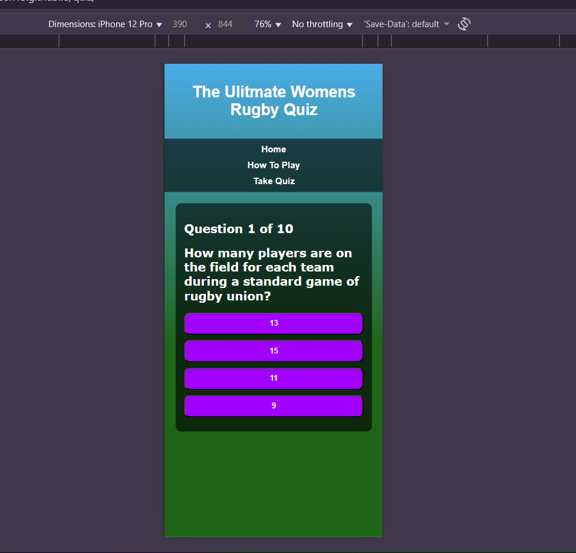

# Quiz
Prodject 3 online interative fun quiz anbout womens rugby built using React, designed to test your knowldge of womens rugby facts from world cup to players. The app is multiple- choice questions and scoring system.

## Features
- 10 questions to test knowledge on womens rugby mutiple choice. 
- Instant answers and score tracking: If the correct answer is selected it will be hightlighted in green. If the answer is selected is incorrect it will highlight in the red.
- how top play page: clearly showing how to play the quiz.
- Results page: hightlight the correct amswers in green and incorrect answers in red.
- Responsive design: optimised for both desktop and image.  
- Navigation: easy access between home, how to play, take the quiz.
- Styled UI: includes dynamic thememed background with overlay for better readability

## Technogogies used
- html
- css
- Javascript 
- React 

## Accessibility
- I have run my the lighthouse ipectction to check the accessbilty leve of my site: 

## valitation 
- I ran my code through a code validator to ensure there are no errors: 
 html : https://validator.w3.org/#validate_by_input See results 
 css: https://jigsaw.w3.org/css-validator/  See results 
  javascript : https://www.site24x7.com/tools/javascript-validator.html  & 

## Getting started
- clone the respository. 
- Navigate into the projec directory.
- Install dependencies.
- Run the project locally.
- Then open your browser and got to http://localhost:3000/ 

## Deployment
 - Deployement to GitHub Pages. The steps to deploy are as follows:
 1. In the [GitHub respository](https://github.com/SarahAnderson15/quiz), navigate to the settings tab.
 2. From the source section drop-down menu, select the Main Branch, then click "Save".
 3. The page will be automatically refreshed with a detailed ribbion display to indicate the successful deployment. 
  The live link can be found [here](https://sarahanderson15.github.io/quiz/) 